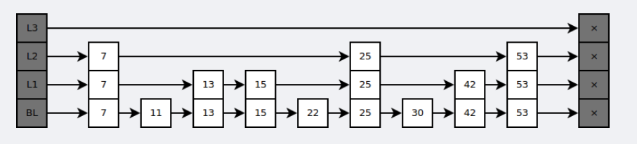
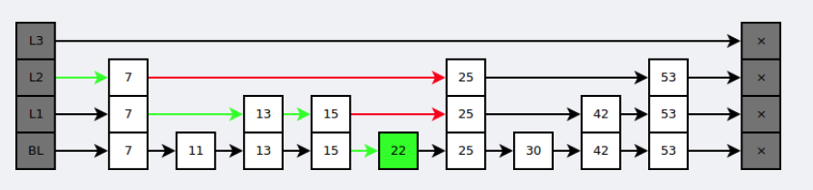

### redis相关知识整理
#### redis底层数据结构
##### 字典
```text

```
##### 跳跃表


```text
是有序集合的底层实现之一。
跳跃表是基于多指针有序链表实现的，可以看成多个有序链表。
与红黑树等平衡树相比，跳跃表具有以下优点：
插入速度非常快速，因为不需要进行旋转等操作来维护平衡性；
更容易实现；
支持无锁操作。
```
#### 数据持久化
```text
Redis 支持两种持久化策略：RDB 快照和 AOF（Append Only File） 日志
RDB会丢失创建最后一次快照之后的所有数据
AOF持久化需要设置同步选项（设置命令刷新到磁盘的时机）
always 每个写命令都同步
everysec 每秒同步一次
no  操作系统决定同步的时机

```### redis相关知识整理
#### redis底层数据结构
##### 字典
```text

```
##### 跳跃表


```text
是有序集合的底层实现之一。
跳跃表是基于多指针有序链表实现的，可以看成多个有序链表。
与红黑树等平衡树相比，跳跃表具有以下优点：
插入速度非常快速，因为不需要进行旋转等操作来维护平衡性；
更容易实现；
支持无锁操作。
```
#### 数据持久化
```text
Redis 支持两种持久化策略：RDB 快照和 AOF（Append Only File） 日志
RDB会丢失创建最后一次快照之后的所有数据
AOF持久化需要设置同步选项（设置命令刷新到磁盘的时机）
always 每个写命令都同步
everysec 每秒同步一次
no  操作系统决定同步的时机
AOF可以设置重写，消除重复的命令
```
#### 数据淘汰策略
| 策略              | 描述                      |
|-----------------|-------------------------|
| volatile-lru    | 设置了过期时间的key按照lru        |
| volatile-ttl    | 设置了过期时间的key挑选过期或将要过期的数据 |
 | volatile-random | 设置了过期时间的key随机淘汰         | 
| allkeys-lru     | 所有key按照lru策略            | 
| allkeys-random  | 所有key随机涛涛               | 
| noeviction      | 禁止驱逐                    |
```text
eviction 驱除、赶出
```
#### 集群
```text
todo 集群模式 分片
```
