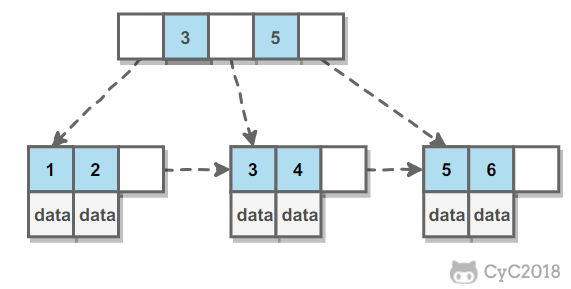
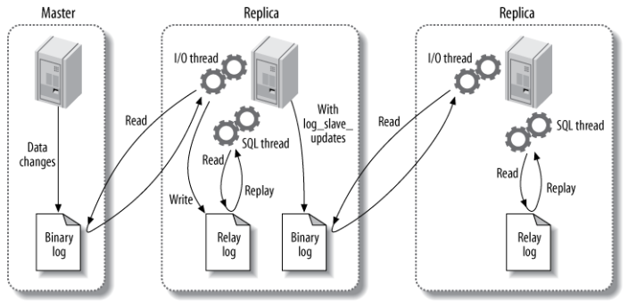
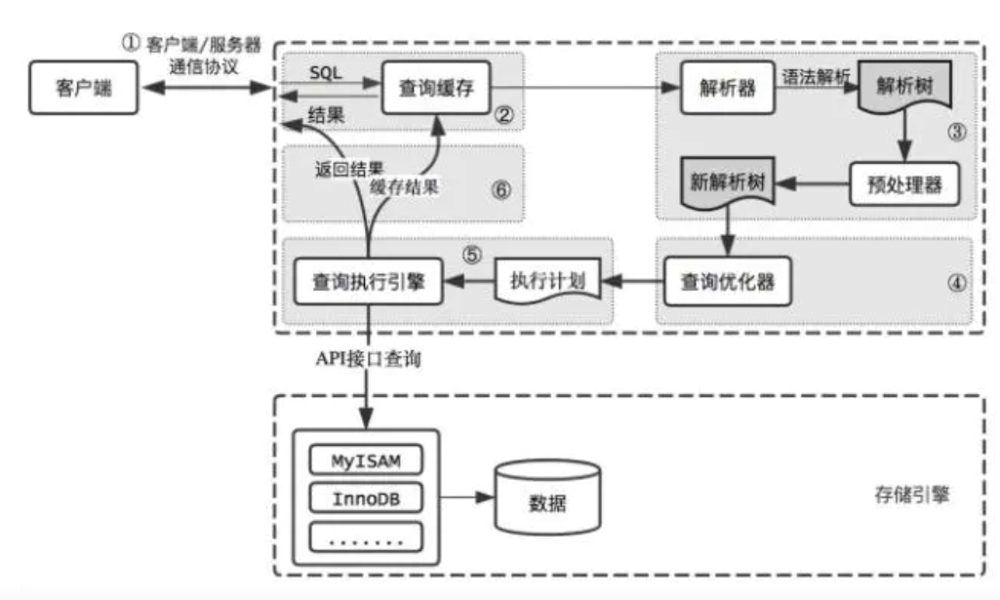

### 数据库
#### 索引类型
| 索引     | 优点               | 缺点          |
|--------|------------------|-------------|
| hash索引 | O(1)时间查找         | 无法排序、无法模糊查找 |
| B+Tree | 相对于BTree树高低，减少IO ||
| 全文索引   | 使用倒排索引实现，用于查找关键词 ||
| 前缀索引   | 适用于text和blob     ||
|R-Tree|用于地理数据存储||
#### B+Tree
```text
BTree是balance tree的简称
叶子节点从左到右升序排序
```

#### 聚簇索引
```text
叶子节点存储完整数据的为聚簇索引
非聚簇索引叶子节点存储的值为主键的值
```
```text
1、有主键时则以主键创建聚簇索引
2、没有主键会使用不能为空的唯一索引作为聚簇索引
3、如果以上两个都不满足那innodb自己创建一个虚拟的字段为主键，
这个字段长度为6个字节，类型为长整形，根据该虚拟主键创建聚集索引
```
#### 主从复制|读写分离
```text
1、从主服务读取bin log
2、解析成中继日志relay log
3、读取中继日志回放主服务器执行过的sql
```

#### SQL执行过程

> 客户端->解析器->预处理器->优化器->执行器->存储引擎
1. 查询缓存，命中缓存则返回结果
2. 语法解析，生成解析树
3. 优化器优化，生成执行计划
4. 执行器调用存储引擎API来执行查询
5. 返回结果给客户端，缓存查询结果