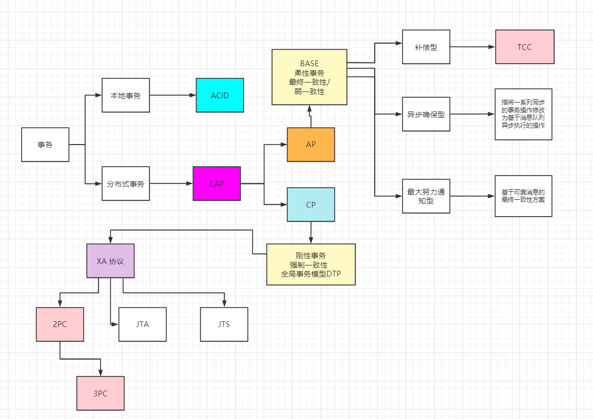
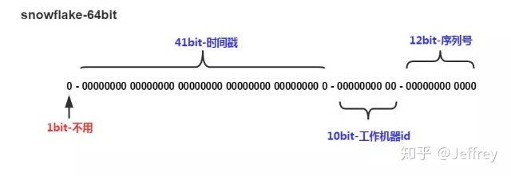

#### 分布式

##### 分布式理论

###### CAP定理

> C Consistency 一致性(强一致性、弱一致性、最终一致性)
> A Availability 可用性(每个请求总能在有限的时间内返回结果)
> P Partition tolerance 分区容错性

```text
在互联⽹领域的绝⼤多数的场景中，都需要牺牲强⼀致性
来换取系统的⾼可⽤性，系统往往只需要保证最终⼀致性
```

###### BASE定理

> CAP是分布式系统设计理论，BASE是CAP理论中AP⽅案的延伸，对于C我们采⽤的⽅式和策略就是保证最终⼀致性
> BASE是Basically Available（基本可⽤）、Soft state（软状态）和 Eventually consistent（最终⼀致性）三个短语的缩写

##### 分布式事务

###### 分类

> 刚性事务 满足CAP理论中的CP理论

```text
XA协议（2PC、JTA、JTS）和3PC，由于同步阻塞，不适合大型分布式场景
XA协议将参与事务的角色分成AP（应用程序）、TM（事务管理器）、RM（资源管理器DB、MQ）
AP⾃⼰操作TM，当需要事务时，AP向TM请求发起事务，TM负责整个事务的提交，回滚等
```

> 柔性事务 满足BASE理论

```text
不要求强一致性，满足最终一致性，允许有中间状态
TCC/FMT、Saga（状态机模式、Aop模式）、本地事务消息、消息事务（半消息）
```
- 补偿型
- 异步确保型
- 最大努力通知型

##### 分布式ID生成

```text
分布式ID需要具备如下特点
全局唯一
趋势递增
单调递增
信息安全
分布式ID生成系统需要具备如下特点
高可用性
高TPS 
```

1. 雪花算法
   

```text
1、第一位占用1bit，始终为0
2、时间戳 占用41bit
3、工作机器id 占用10bit，其中高位5bit是数据中心ID，低位5bit是工作节点ID，做多可以容纳1024个节点
4、序列号 占用12bit，每个节点每毫秒0开始不断累加，最多可以累加到4095，一共可以产生4096个ID
SnowFlake算法在同一毫秒内最多可以生成多少个全局唯一ID呢：： 同一毫秒的ID数量 = 1024 X 4096 = 4194304
```

2. UUID

```text
优点:简单、效率高
缺点:ID过长，影响存储和查询效率
```

3. redis
4. zookeeper
5. db
