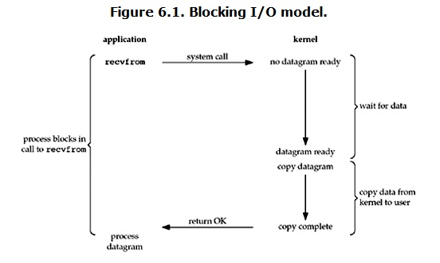
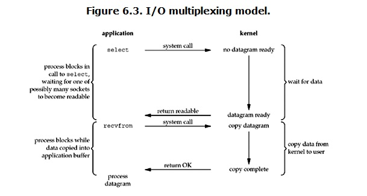
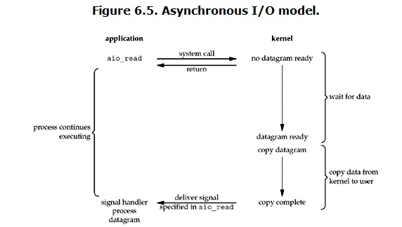

### IO知识

#### Linux五种IO模型

```text
在linux中，默认情况下所有得到socket都是blocking
kernel等待足够的数据到来，然后将数据拷贝到内核缓存区，在将数据拷贝到用户内存
```



- 阻塞IO模型 blocking IO

```text
调用recvfrom系统调用时，在kernel准备好数据之前，用户线程会一直处于blocking状态
```

- 非阻塞IO模型 non-blocking IO

```text
调用recvfrom时，数据没准备好的时候，会立即返回error，用户线程不会blocking，
用户线程可以根据返回的是否时error判断数据有没有准备好，用户可以持续调用recvfrom系统调用
```

- 多路复用IO模型 IO multiplexing

```text
多路复用说的时select、poll、epoll，也称为事件驱动IO。
基本原理是上述三个功能会不断轮询所有负责的socket，某个socket有数据到达，就通知用户线程
其特点是一个线程能同时等待多个socket，其中任意一个有数据就绪，select等就可以返回
和blocking IO 没有本质的区别，只是一个线程可以管理多个socket，性能上还相对差些，因为有两次系统调用
```



```text
该模型中每个socket要设置成non-blocking,但是线程会被select阻塞
```

- 信号驱动IO模型

```text
在信号驱动 IO 模型中，当用户线程发起一个 IO 请求操作，会给对应的 socket 注册一个信号函数，然后用户线程会继续执行，当内核数据就绪时会发送一个信号给用户线程，用户线程接收到信号之后，便在信号函数中调用 IO 读写操作来进行实际的 IO 请求操作
```

- 异步IO模型
  

```text
异步 IO 模型中， IO 操作的两个阶段都不会阻塞用户线程，这两个阶段都是由内核自动完成，然后发送一个信号告知用户线程操作已完成。用户线程中不需要再次调用 IO 函数进行具体的读写。这点是和信号驱动模型有所不同的，在信号驱动模型中，当用户线程接收到信号表示数据已经就绪，然后需要用户线程调用 IO 函数进行实际的读写操作；而在异步 IO 模型中，收到信号表示 IO 操作已经完成，不需要再在用户线程中调用 IO 函数进行实际的读写操作。
异步 IO 是需要操作系统的底层支持，在 Java 7 中，提供了 Asynchronous IO
```

#### IO模式比较


#### BIO、NIO、AIO

```text
BIO 同步阻塞模式（recvfrom阻塞、数据从内核空间copy到用户空间也是阻塞的）
NIO 同步非阻塞(recvfrom不阻塞，copy数据时阻塞)
AIO 异步非阻塞(上述两个过程都不阻塞，数据准备好了直接通知)
```

#### select、poll、epoll什么区别

```text
Linux提供的三种IO多路复用机制，使一个进程可以监听多个描述符

```

- select

```text
int select (int n, fd_set *readfds, fd_set *writefds, fd_set *exceptfds, struct timeval *timeout);
select 函数监视的文件描述符分3类，分别是writefds、readfds、和exceptfds。调用后select函数会阻塞，直到有描述副就绪（有数据 可读、可写、或者有except），或者超时（timeout指定等待时间，如果立即返回设为null即可），函数返回。当select函数返回后，可以 通过遍历fdset，来找到就绪的描述符。
select目前几乎在所有的平台上支持，其良好跨平台支持也是它的一个优点。select的一 个缺点在于单个进程能够监视的文件描述符的数量存在最大限制，在Linux上一般为1024，可以通过修改宏定义甚至重新编译内核的方式提升这一限制，但 是这样也会造成效率的降低。
```

- poll

```text
int poll (struct pollfd *fds, unsigned int nfds, int timeout);
struct pollfd {
    int fd; /* file descriptor */
    short events; /* requested events to watch */
    short revents; /* returned events witnessed */
};
pollfd结构包含了要监视的event和发生的event，不再使用select“参数-值”传递的方式。同时，pollfd并没有最大数量限制（但是数量过大后性能也是会下降）。 和select函数一样，poll返回后，需要轮询pollfd来获取就绪的描述符。
从上面看，select和poll都需要在返回后，通过遍历文件描述符来获取已经就绪的socket。事实上，同时连接的大量客户端在一时刻可能只有很少的处于就绪状态，因此随着监视的描述符数量的增长，其效率也会线性下降。
```
- epoll
```text
epoll是在2.6内核中提出的，是之前的select和poll的增强版本。相对于select和poll来说，epoll更加灵活，没有描述符限制。epoll使用一个文件描述符管理多个描述符，将用户关系的文件描述符的事件存放到内核的一个事件表中，这样在用户空间和内核空间的copy只需一次。
epoll对文件描述符的操作有两种模式：LT（level trigger）和ET（edge trigger）
LT模式:应用程序可以不立即处理该事件。下次调用epoll_wait时，会再次响应应用程序并通知此事件。
ET模式:如果不处理，下次调用epoll_wait时，不会再次响应应用程序并通知此事件。
```

#### epoll优势
- 通过epoll_ctl来注册文件描述符，不用传递管理的所有文件描述符
- 调用epoll_wait时会得到通知
- 监视的描述符数量不受限制
#### java BIO和 NIO

```text
IO是面向流的，NIO是面向缓冲区的
IO分为字节流[inputStream、outputStream]和字符流[reader、writer]
```

##### java NIO

```text
NIO主要有三大核心部分 Channel、Buffer、Selector
传统IO基于字节流和字符流进行操作，而NIO基于Channel和Buffer进行操作，数据总是从通道读到缓存区，或者从缓存区写到通道中
selector用于监听多个通道的事件
```