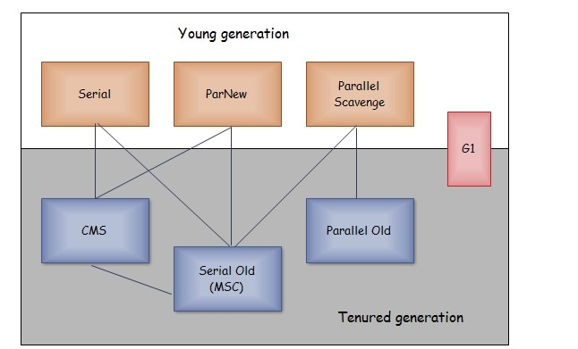

#### JVM

##### JVM内存布局

##### 堆内存细分

```text
使用的式分代垃圾回收器
内存分为新生代（ Eden区、Survivor区）和老年代
逻辑上的划分，不需要连续
-xmx -xms
```

##### 对象在堆中的生命周期

```text

```

##### TLAB(Thread Local Allocation Buffer)

```text
jvm会为每个线程在eden区分配一块私有的缓存区域
eden区是线程共享的区域，会存在线程安全问题，而eden区创建对象是很频繁的
使用TLAB可以避免线程安全问题（避免加锁），提高效率，将这种内存分配策略称为快速分配策略
默认情况下TLAB的内存空间是很小的，仅占整个Eden区的1%
可以通过-XX:TLABWasteTargetPercent 设置 TLAB 空间所占用 Eden 空间的百分比大小。
```

##### 如何判断对象是否是垃圾

- 引用计数法

```text
给对象添加一个引用计数器
存在循环引用问题
```

- 引用可达法

```text
通过GC Roots 作为起点搜索，能够到达的对象都是存活的，不可到达的对象可被回收
```

- GC Roots

1. 虚拟机栈中引用的对象
2. 本地方法栈中引用的对象
3. 方法区中类静态属性引用的对象
4. 方法区中的常量引用的对象

##### 对象的引用类型

- 强引用
- 软引用

```text
被软引用关联的对象只有在内存不够的情况下会被回收
Object obj = new Object();
SoftReference<Object> sf = new SoftReference<Object>(obj);
obj = null;  // 使对象只被软引用关联
```

- 弱引用

```text
被弱引用关联的对象一定会被回收，只能存活到下一次垃圾回收发生之前
Object obj = new Object();
WeakReference<Object> wf = new WeakReference<Object>(obj);
obj = null;
```

- 虚引用

```text
又称为幽灵引用或者幻影引用。一个对象是否有虚引用的存在，完全不会对其生存时间构成影响，也无法通过虚引用取得一个对象。
为一个对象设置虚引用关联的唯一目的就是能在这个对象被回收时收到一个系统通知。
Object obj = new Object();
PhantomReference<Object> pf = new PhantomReference<Object>(obj);
obj = null;
```

##### 垃圾回收算法

> 新生代使用复制算法
> 老年代使用标记清除或标记整理

- 复制算法

```text
内存划分为两块，每次只使用其中一块
商业虚拟机新生代使用复制算法
HotSpot 虚拟机的 Eden 和 Survivor 的大小比例默认为 8:1，
保证了内存的利用率达到 90%。
如果每次回收有多于 10% 的对象存活，
那么一块 Survivor 空间就不够用了，
此时需要依赖于老年代进行分配担保，
也就是借用老年代的空间存储放不下的对象。
```

- 标记清除|标记整理

```text
标记和清除过程效率都不高
会产生大量的内存碎片，导致无法给大对象分配内存
```

##### 垃圾回收器

- 分代垃圾回收器

```text

```

- 分区垃圾回收器

##### Hotspot中的垃圾回收器



- Serial
- Serial Old
- CMS(Concurrent Mark Sweep)

```text
初始标记: 仅仅只是标记一下 GC Roots 能直接关联到的对象，速度很快，需要停顿。 
并发标记: 进行 GC Roots Tracing 的过程，它在整个回收过程中耗时最长，不需要停顿。 
重新标记: 为了修正并发标记期间因用户程序继续运作而导致标记产生变动的那一部分对象的标记记录，需要停顿。 
并发清除: 不需要停顿。
```

- ParNew
- Parallel Scavenge
- Parallel Old
- G1(分区垃圾回收器)

```text
G1(Garbage-First)，它是一款面向服务端应用的垃圾收集器，在多CPU和大内存的场景下有很好的性能。
HotSpot 开发团队赋予它的使命是未来可以替换掉 CMS 收集器。
堆被分为新生代和老年代，其它收集器进行收集的范围都是整个新生代或者老年代，而 G1 可以直接对新生代和老年代一起回收。
G1 把堆划分成多个大小相等的独立区域(Region)，新生代和老年代不再物理隔离。
```
##### 触发Full GC情况
- 调用 System.gc() (建议执行，不一定会真的执行)
- 老年代空间不足
- 空间分配担保失败
```text
Minor GC时sur区空间不够，需要老年代内存做担保时，担保失败会触发Full GC
```