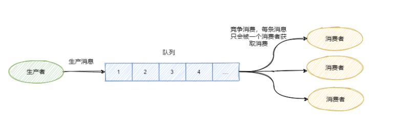
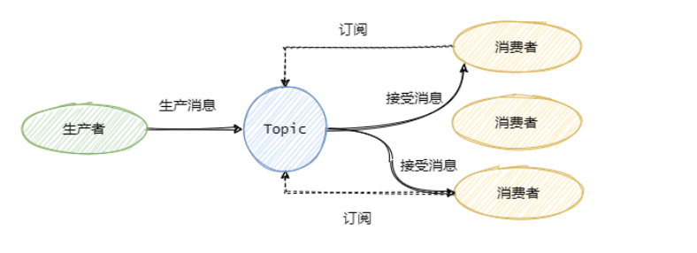
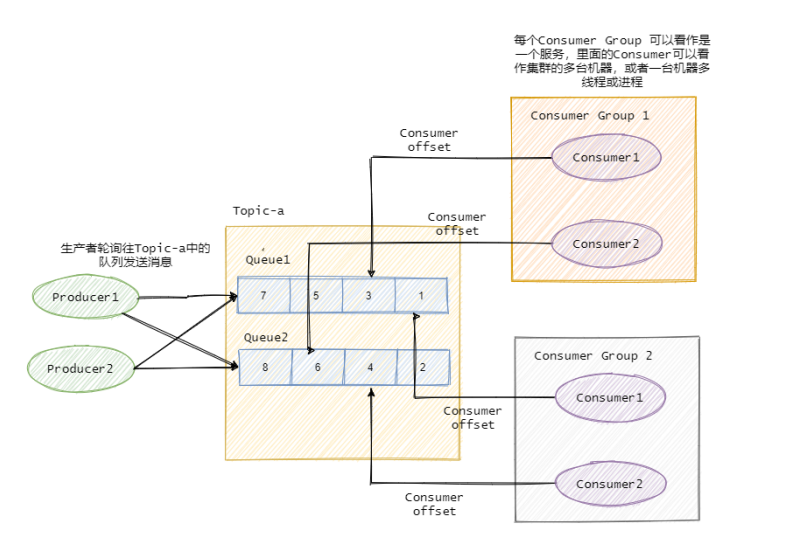
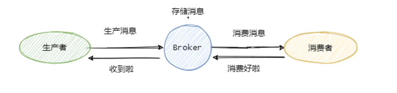

### MQ
#### MQ 作用
1. 异步处理
2. 流量控制
3. 服务解耦
#### 消息队列有两种模型
1. 队列模型
   
```text
多个消费者消费同一个队列的消息，是竞争光系，每个消息只能被消费一次
```
2. 发布/订阅
   
3. 总结
```text
队列模型每条消息只能被一个消费者消费，而发布/订阅模型就是为让一条消息可以被多个消费者消费
而生的，当然队列模型也可以通过消息全量存储至多个队列来解决一条消息被多个消费者消费问题，但
是会有数据的冗余。
发布/订阅模型兼容队列模型，即只有一个消费者的情况下和队列模型基本一致。
RabbitMQ 采用队列模型， RocketMQ 和 Kafka 采用发布/订阅模型。
为了提高并发度，往往发布/订阅模型还会引入队列或者分区的概念。即消息是发往一个主题下的某个
队列或者某个分区中。 RocketMQ 中叫队列， Kafka 叫分区，本质一样。
```

```text
每个消费者对应一个topic下的一个队列(分区)
```
#### 如何保证消息不丢失

```text
mq分三部分角色，produce、broker、consumer
消息的传递有三个阶段，发送消息、存储消息、消费消息
1. produce发完消息后要处理broker的响应，broker返回错误信息后要做消息的重新发送
2. broker要在消息刷盘后才返回成功
   如何是集群部署，还需要保证消息写入从节点
3. consumer在正确处理完所有业务后才发送消费成功的消息至broker
```
#### 如何避免重复消费
```text
消息重复消费在业务上不可避免，关键是做到在重复消费的情况下不影响结果，消费者要做消息的幂等
需要根据具体的业务来分析，可以利用数据库的唯一索引，增加版本号的判断，缓存处理过的消息的唯一Id等
```
#### 如何保证消息的有序性
##### 全局有序
```text
需要保证消息发送有序，队列或分区内存储有序，消费者消费有序
```
```text
只能一个生产者往队列(分区)内发消息，且一个topic下只能有一个队列(分区)，
消费者也只能有一个，且是单线程消费，这样才能保证全局有序
```
##### 部分有序
```text
将topic划分成多个队列或分区，每个生产者往指定的队列发消息，每个队列对应一个单线程的消费者
```
#### 如何处理消息堆积
```text
首先要定位消息堆积的原因
1.生产者的生产速度和消费者的消费速度不匹配
2.消息失败反复重试造成的 
3.消费者消费能力弱
更具具体的原因选择不同的处理方案
处理bug,优化消费逻辑,水平扩容(增加topic下队列数量，增加消费者数量和线程数)
```
#### Kafka和RocketMq的区别
##### 参考资料
```text
https://www.cnblogs.com/ynyhl/p/11320797.html
https://zhuanlan.zhihu.com/p/423309452
```
1. 数据可靠性
> RocketMQ支持异步刷盘、同步刷盘、同步Replication、异步Replication
> Kafka支持异步刷盘、异步Replication

> RocketMQ的同步刷盘和同步Replication使其消息可靠性高于Kafka
> Kafka支持主备切换，但是会造成消息不一致

2. 性能对比
```text
kafka单机写入在17w/s高于RocketMQ，消息在10K
```
> Kafka的Producer端会将小消息合并发送至broker

3. 支持的队列数对比
```text
Kafka单机超过64个分区，load会发生明显的飙高现象，队列越多load越高
RocketMQ单机支持最高5万个队列，Load不会发生明显变化

RocketMQ的队列不存储消息，消息存在commit log中
队列多了后commit log依旧还是顺序写
队列中的每个节点的大小为20k，占用的存储空间小，刷盘的次数减少
```
```text
单机可以创建更多Topic，因为每个Topic都是由一批队列组成
Consumer的集群规模和队列数成正比，队列越多，Consumer集群可以越大
```
4. 消息实时性
> Kafka使用短轮询，消息延时取决于轮询事件
> RocketMQ使用长轮询，同Push方式实时性一致(long pull)

5. 严格的顺序消息
- Kafka支持消息顺序，但是一台Broker宕机后，就会产生消息乱序
- RocketMQ支持严格的消息顺序，在顺序消息场景下，一台Broker宕机后，发送消息会失败，但是不会乱序

6. 消息回溯
- Kafka理论上可以按照Offset来回溯消息
- RocketMQ支持按照时间来回溯消息，精度毫秒，例如从一天之前的某时某分某秒开始重新消费消息
7. 消费并行度
- Kafka消费并行度和分区一致
> Kafka的消费并行度依赖Topic配置的分区数，如分区数为10，那么最多10台机器来并行消费（每台机器只能开启一个线程），或者一台机器消费（10个线程并行消费）
- RocketMQ消费并行度分两种情况
> 顺序消费方式并行度同Kafka完全一致
> 乱序方式并行度取决于Consumer的线程数，如Topic配置10个队列，10台机器消费，每台机器100个线程，那么并行度为1000


8. RocketMQ 特有特性
> RocketMQ 支持消息重试、定时消息、消息查询、分布式事务消息、消息轨迹、消息过滤(tag)
