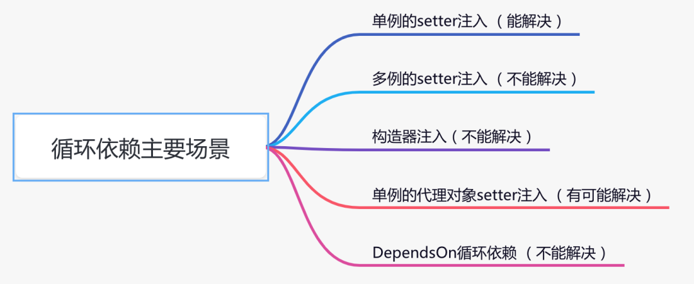
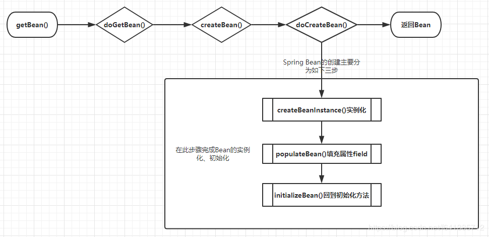
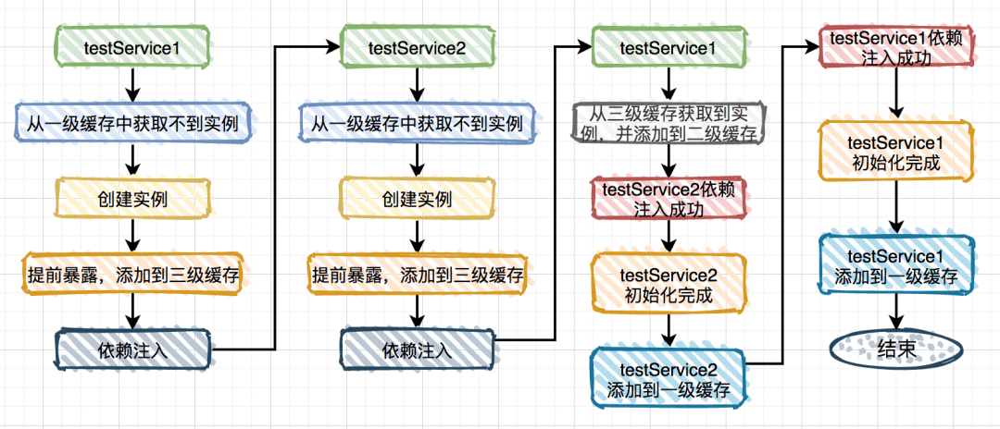

#### Spring、SpringBoot、SpringCloud面试题

##### spring bean的生命周期

##### spring如何解决循环依赖

###### 结论

> spring 利用三级缓存的形式来提前暴露和注入实例化的对象的形式来解决循环依赖
> 只能解决单例的setter注入
> 无法解决构造器造成的循环依赖
> 无法解决多例的setter注入
> 无法解决单例的代理对象注入(有可能解决)
> 无法解决DependsOn循环依赖



###### 弊端解决

```text
@Lazy 解决构造循环依赖
使用@DependsOn注解，指定加载先后关系
```

###### 原理




```java
public abstract class AbstractBeanFactory extends FactoryBeanRegistrySupport implements ConfigurableBeanFactory {

  protected <T> T doGetBean(final String name, @Nullable final Class<T> requiredType, @Nullable final Object[] args, boolean typeCheckOnly) throws BeansException {

    // Eagerly check singleton cache for manually registered singletons.
    // 先去获取一次，如果不为null，此处就会走缓存了~~
    Object sharedInstance = getSingleton(beanName);

    // 如果不是只检查类型，那就标记这个Bean被创建了~~添加到缓存里 也就是所谓的  当前创建Bean池
    if (!typeCheckOnly) {
      markBeanAsCreated(beanName);
    }

    // Create bean instance.
    if (mbd.isSingleton()) {

      // 这个getSingleton方法不是SingletonBeanRegistry的接口方法  属于实现类DefaultSingletonBeanRegistry的一个public重载方法~~~
      // 它的特点是在执行singletonFactory.getObject();前后会执行beforeSingletonCreation(beanName);和afterSingletonCreation(beanName);  
      // 也就是保证这个Bean在创建过程中，放入正在创建的缓存池里  可以看到它实际创建bean调用的是我们的createBean方法~~~~
      sharedInstance = getSingleton(beanName, () -> {
        try {
          return createBean(beanName, mbd, args);
        } catch (BeansException ex) {
          destroySingleton(beanName);
          throw ex;
        }
      });
      bean = getObjectForBeanInstance(sharedInstance, name, beanName, mbd);
    }
  }

}

// 抽象方法createBean所在地  这个接口方法是属于抽象父类AbstractBeanFactory的   实现在这个抽象类里
public abstract class AbstractAutowireCapableBeanFactory extends AbstractBeanFactory implements AutowireCapableBeanFactory {

  protected Object doCreateBean(final String beanName, final RootBeanDefinition mbd, final @Nullable Object[] args) throws BeanCreationException {

    // 创建Bean对象，并且将对象包裹在BeanWrapper 中
    instanceWrapper = createBeanInstance(beanName, mbd, args);
    // 再从Wrapper中把Bean原始对象（非代理~~~）  这个时候这个Bean就有地址值了，就能被引用了~~~
    // 注意：此处是原始对象，这点非常的重要
    final Object bean = instanceWrapper.getWrappedInstance();

    // earlySingletonExposure 用于表示是否”提前暴露“原始对象的引用，用于解决循环依赖。
    // 对于单例Bean，该变量一般为 true   但你也可以通过属性allowCircularReferences = false来关闭循环引用
    // isSingletonCurrentlyInCreation(beanName) 表示当前bean必须在创建中才行
    boolean earlySingletonExposure = (mbd.isSingleton() && this.allowCircularReferences && isSingletonCurrentlyInCreation(beanName));
    if (earlySingletonExposure) {
      if (logger.isTraceEnabled()) {
        logger.trace("Eagerly caching bean '" + beanName + "' to allow for resolving potential circular references");
      }
      // 上面讲过调用此方法放进一个ObjectFactory，二级缓存会对应删除的
      // getEarlyBeanReference的作用：调用SmartInstantiationAwareBeanPostProcessor.getEarlyBeanReference()这个方法  否则啥都不做
      // 也就是给调用者个机会，自己去实现暴露这个bean的应用的逻辑~~~
      // 比如在getEarlyBeanReference()里可以实现AOP的逻辑~~~  参考自动代理创建器AbstractAutoProxyCreator  实现了这个方法来创建代理对象
      // 若不需要执行AOP的逻辑，直接返回Bean
      addSingletonFactory(beanName, () -> getEarlyBeanReference(beanName, mbd, bean));
    }
    Object exposedObject = bean; //exposedObject 是最终返回的对象

    // 填充属于，解决@Autowired依赖~
    populateBean(beanName, mbd, instanceWrapper);
    // 执行初始化回调方法们~~~
    exposedObject = initializeBean(beanName, exposedObject, mbd);

    // earlySingletonExposure：如果你的bean允许被早期暴露出去 也就是说可以被循环引用  那这里就会进行检查
    // 此段代码非常重要~~~~~但大多数人都忽略了它
    if (earlySingletonExposure) {
      // 此时一级缓存肯定还没数据，但是呢此时候二级缓存earlySingletonObjects也没数据
      //注意，注意：第二参数为false  表示不会再去三级缓存里查了~~~

      // 此处非常巧妙的一点：：：因为上面各式各样的实例化、初始化的后置处理器都执行了，如果你在上面执行了这一句
      //  ((ConfigurableListableBeanFactory)this.beanFactory).registerSingleton(beanName, bean);
      // 那么此处得到的earlySingletonReference 的引用最终会是你手动放进去的Bean最终返回，完美的实现了"偷天换日" 特别适合中间件的设计
      // 我们知道，执行完此doCreateBean后执行addSingleton()  其实就是把自己再添加一次  **再一次强调，完美实现偷天换日**
      Object earlySingletonReference = getSingleton(beanName, false);
      if (earlySingletonReference != null) {

        // 这个意思是如果经过了initializeBean()后，exposedObject还是木有变，那就可以大胆放心的返回了
        // initializeBean会调用后置处理器，这个时候可以生成一个代理对象，那这个时候它哥俩就不会相等了 走else去判断吧
        if (exposedObject == bean) {
          exposedObject = earlySingletonReference;
        }

        // allowRawInjectionDespiteWrapping这个值默认是false
        // hasDependentBean：若它有依赖的bean 那就需要继续校验了~~~(若没有依赖的 就放过它~)
        else if (!this.allowRawInjectionDespiteWrapping && hasDependentBean(beanName)) {
          // 拿到它所依赖的Bean们~~~~ 下面会遍历一个一个的去看~~
          String[] dependentBeans = getDependentBeans(beanName);
          Set<String> actualDependentBeans = new LinkedHashSet<>(dependentBeans.length);

          // 一个个检查它所以Bean
          // removeSingletonIfCreatedForTypeCheckOnly这个放见下面  在AbstractBeanFactory里面
          // 简单的说，它如果判断到该dependentBean并没有在创建中的了的情况下,那就把它从所有缓存中移除~~~  并且返回true
          // 否则（比如确实在创建中） 那就返回false 进入我们的if里面~  表示所谓的真正依赖
          //（解释：就是真的需要依赖它先实例化，才能实例化自己的依赖）
          for (String dependentBean : dependentBeans) {
            if (!removeSingletonIfCreatedForTypeCheckOnly(dependentBean)) {
              actualDependentBeans.add(dependentBean);
            }
          }

          // 若存在真正依赖，那就报错（不要等到内存移除你才报错，那是非常不友好的） 
          // 这个异常是BeanCurrentlyInCreationException，报错日志也稍微留意一下，方便定位错误~~~~
          if (!actualDependentBeans.isEmpty()) {
            throw new BeanCurrentlyInCreationException(beanName,
                "Bean with name '" + beanName + "' has been injected into other beans [" +
                    StringUtils.collectionToCommaDelimitedString(actualDependentBeans) +
                    "] in its raw version as part of a circular reference, but has eventually been " +
                    "wrapped. This means that said other beans do not use the final version of the " +
                    "bean. This is often the result of over-eager type matching - consider using " +
                    "'getBeanNamesOfType' with the 'allowEagerInit' flag turned off, for example.");
          }
        }
      }
    }

    return exposedObject;
  }

  // 虽然是remove方法 但是它的返回值也非常重要
  // 该方法唯一调用的地方就是循环依赖的最后检查处~~~~~
  protected boolean removeSingletonIfCreatedForTypeCheckOnly(String beanName) {
    // 如果这个bean不在创建中  比如是ForTypeCheckOnly的  那就移除掉
    if (!this.alreadyCreated.contains(beanName)) {
      removeSingleton(beanName);
      return true;
    } else {
      return false;
    }
  }

}
```

```java
public class DefaultSingletonBeanRegistry extends SimpleAliasRegistry implements SingletonBeanRegistry {

  // 从上至下 分表代表这“三级缓存”
  private final Map<String, Object> singletonObjects = new ConcurrentHashMap<>(256); //一级缓存
  private final Map<String, Object> earlySingletonObjects = new HashMap<>(16); // 二级缓存
  private final Map<String, ObjectFactory<?>> singletonFactories = new HashMap<>(16); // 三级缓存

  /** Names of beans that are currently in creation. */
  // 这个缓存也十分重要：它表示bean创建过程中都会在里面呆着~
  // 它在Bean开始创建时放值，创建完成时会将其移出~
  private final Set<String> singletonsCurrentlyInCreation = Collections.newSetFromMap(new ConcurrentHashMap<>(16));

  /** Names of beans that have already been created at least once. */
  // 当这个Bean被创建完成后，会标记为这个 注意：这里是set集合 不会重复
  // 至少被创建了一次的  都会放进这里~~~~
  private final Set<String> alreadyCreated = Collections.newSetFromMap(new ConcurrentHashMap<>(256));

  @Override
  @Nullable
  public Object getSingleton(String beanName) {
    return getSingleton(beanName, true);
  }

  @Nullable
  protected Object getSingleton(String beanName, boolean allowEarlyReference) {
    Object singletonObject = this.singletonObjects.get(beanName);
    if (singletonObject == null && isSingletonCurrentlyInCreation(beanName)) {
      synchronized (this.singletonObjects) {
        singletonObject = this.earlySingletonObjects.get(beanName);
        if (singletonObject == null && allowEarlyReference) {
          ObjectFactory<?> singletonFactory = this.singletonFactories.get(beanName);
          if (singletonFactory != null) {
            singletonObject = singletonFactory.getObject();
            this.earlySingletonObjects.put(beanName, singletonObject);
            this.singletonFactories.remove(beanName);
          }
        }
      }
    }
    return singletonObject;
  }

  public boolean isSingletonCurrentlyInCreation(String beanName) {
    return this.singletonsCurrentlyInCreation.contains(beanName);
  }

  protected boolean isActuallyInCreation(String beanName) {
    return isSingletonCurrentlyInCreation(beanName);
  }
}
```

- 参考资料
  [spring：我是如何解决循环依赖的？](https://cloud.tencent.com/developer/article/1769948)
  [一文告诉你Spring是如何利用"三级缓存"巧妙解决Bean的循环依赖问题的【享学Spring】](https://cloud.tencent.com/developer/article/1497692)

##### Autowired 和 Resource 区别

1. 两者都可以使用在字段和setter方法上
2. Autowired是Spring框架下的，Resource是j2ee规范下的
3. Autowired根据类型和字段名称来装配，需要指定名称时需结合qualifier使用
4. Autowired 的属性require可以指定为false
5. Resource在没有指定name属性的值的情况下也是根据类型和字段名称来装配

##### spring的事务

###### 原理

> 本质是对数据库事务的支持
> 基于AOP实现
```text
// 获取连接 自动提交设置为false commit rollback close
Connection conn = DriverManager.getConnection();
try {  
    conn.setAutoCommit(false);  //将自动提交设置为false                         
    执行CRUD操作 
    conn.commit();      //当两个操作成功后手动提交  
} catch (Exception e) {  
    conn.rollback();    //一旦其中一个操作出错都将回滚，所有操作都不成功
    e.printStackTrace();  
} finally {
    conn.close();
}
```

###### 事务隔离级别

> Connect中定义了五种事务隔离级别

- TRANSACTION_NONE
- TRANSACTION_READ_UNCOMMITTED
- TRANSACTION_READ_COMMITTED
- TRANSACTION_REPEATABLE_READ
- TRANSACTION_SERIALIZABLE

###### Spring事务的传播属性

> Spring定义了7种事务的传播属性

|类型| 值   |说明|
|----------- |-----|----------- |
|PROPAGATION_REQUIRED| 0   |支持当前事务，如果当前没有事务，就新建一个事务。这是最常见的选择，也是Spring默认的事务的传播。|
|PROPAGATION_SUPPORTS| 1   |支持当前事务，如果当前没有事务，就以非事务方式执行|
|PROPAGATION_MANDATORY| 2   | 支持当前事务，如果当前没有事务，就抛出异常                                     |
|PROPAGATION_REQUIRES_NEW| 3   | 新建事务，如果当前存在事务，把当前事务挂起                                     |
|PROPAGATION_NOT_SUPPORTED| 4   | 以非事务方式执行操作，如果当前存在事务，就把当前事务挂起                              |
|PROPAGATION_NEVER| 5   | 以非事务方式执行，如果当前存在事务，则抛出异常                                   |
|PROPAGATION_NESTED| 6   | 如果当前存在事务，则在嵌套事务内执行。如果当前没有事务，则进行与PROPAGATION_REQUIRED类似的操作 |

###### Spring的事务隔离级别

> Spring中定义了事务的五种隔离级别

|类型| 值   |说明|
|----------- |-----|----------- |
|ISOLATION_DEFAULT|-1|这是一个PlatfromTransactionManager默认的隔离级别，使用数据库默认的事务隔离级别。另外四个与JDBC的隔离级别相对应|
|ISOLATION_READ_UNCOMMITTED|1|这是事务最低的隔离级别，它充许另外一个事务可以看到这个事务未提交的数据。这种隔离级别会产生脏读，不可重复读和幻读。|
|ISOLATION_READ_COMMITTED|2|保证一个事务修改的数据提交后才能被另外一个事务读取。另外一个事务不能读取该事务未提交的数据。|
|ISOLATION_REPEATABLE_READ|4|这种事务隔离级别可以防止脏读，不可重复读。但是可能出现幻读。|
|ISOLATION_SERIALIZABLE|8|这是花费最高代价但是最可靠的事务隔离级别。事务被处理为顺序执行。除了防止脏读，不可重复读外，还避免了幻读。|

###### Spring事务类型

> 编程式事务
> 声明式事务

###### spring事务失效的场景
1. 未启用spring事务管理功能
```text
@EnableTransactionManagement 注解用来启用spring事务自动管理事务的功能
```
2. 数据源未配置事务管理器
```text
@Bean
public PlatformTransactionManager transactionManager(DataSource dataSource) {
    return new DataSourceTransactionManager(dataSource);
}
```
3. 方法不是public类型的
```text
spring是通过aop的方式，对需要spring管理事务的bean生成了代理对象，
然后通过代理对象拦截了目标方法的执行，在方法前后添加了事务的功能，
所以必须通过代理对象调用目标方法的时候，事务才会起效
```
4. 自身调用问题
5. 异常类型错误
6. 异常被吞了
7. 业务和spring事务代码必须在一个线程中

##### SpringBoot的自动装配
##### Http的请求流程
##### Get Post的区别