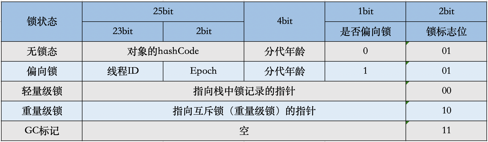
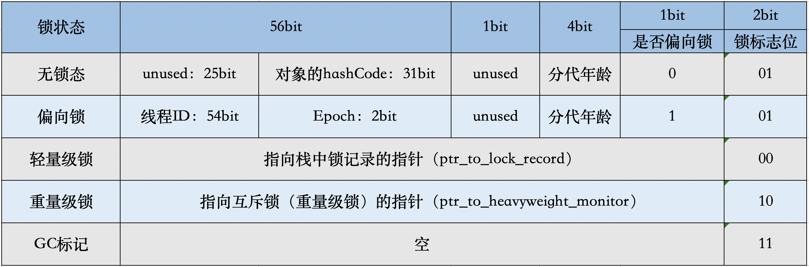

### 面试题

#### java基础

- HashMap的内部实现和扩容
```text
数组+链表|红黑树的形式

```
- 双亲委派模型
- synchronized的原理
```text
变成重量级锁之后利用的是monitorEnter和monitorExit
```
- 线程池的参数和任务提交流程

###### 线程池参数

```text
public ThreadPoolExecutor(
    int corePoolSize,
    int maximumPoolSize,
    long keepAliveTime,
    TimeUnit unit,
    BlockingQueue<Runnable> workQueue,
    ThreadFactory threadFactory,
    RejectedExecutionHandler handler) {}
核心线程数
最大线程数
空闲线程回收时间
任务队列(阻塞队列，有界队列，无界队列)
线程工厂(用于创建线程)
拒绝策略{
CallerRunsPolicy 调用提交任务的线程执行
AbortPolicy 抛出RejectedExecutionException
DiscardPolicy  直接丢弃任务
DiscardOldestPolicy 丢弃最久的任务
}
```

###### 任务提交流程

```java
public class ThreadPoolExecutor {
  public void execute(Runnable command) {
    if (command == null)
      throw new NullPointerException();
    /*
     * Proceed in 3 steps:
     *
     * 1. If fewer than corePoolSize threads are running, try to
     * start a new thread with the given command as its first
     * task.  The call to addWorker atomically checks runState and
     * workerCount, and so prevents false alarms that would add
     * threads when it shouldn't, by returning false.
     *
     * 2. If a task can be successfully queued, then we still need
     * to double-check whether we should have added a thread
     * (because existing ones died since last checking) or that
     * the pool shut down since entry into this method. So we
     * recheck state and if necessary roll back the enqueuing if
     * stopped, or start a new thread if there are none.
     *
     * 3. If we cannot queue task, then we try to add a new
     * thread.  If it fails, we know we are shut down or saturated
     * and so reject the task.
     */
    int c = ctl.get();
    if (workerCountOf(c) < corePoolSize) {
      if (addWorker(command, true))
        return;
      c = ctl.get();
    }
    if (isRunning(c) && workQueue.offer(command)) {
      int recheck = ctl.get();
      if (!isRunning(recheck) && remove(command))
        reject(command);
      else if (workerCountOf(recheck) == 0)
        addWorker(null, false);
    } else if (!addWorker(command, false))
      reject(command);
  }
}
```

```text
其核心是execute方法
0、判断提交的任务是否为空
//判断工作线程数量(小于核心线程则创建worker，command作为第一个任务)
1、if(workerCountOf(c)< corePoolSize){
    if(addWorker(command,true)){
      return;
    }
   //则创建新的Worker，将提交的任务作为第一个任务，成功则结束
   //失败则进入流程2
}
//判断线程池是否运行并且将任务添加至队列
if(isRunning(c)&&offer(command)){ 
  //再次判断线程池是否运行，未运行则移除任务
  //线程池运行则判断worker数量，为0则创建线程去执行队列任务
  //线程池此时可能处于关闭状态，再做一层判断
  if(!isRunning(c) && remove(command)){
   reject(command);
  }else if (workerCountOf(recheck) == 0){
   addWorker(null, false);
  }
} 
//添加新的线程来执行任务,false表示非核心线程
//失败则使用拒绝策略
else if(!addWorker(command,false)){
  reject(command);
}
```
###### 线程过期时间判断
```text
如果发生了以下四件事中的任意一件，那么Worker需要被回收：

Worker个数比线程池最大大小要大

线程池处于STOP状态

线程池处于SHUTDOWN状态并且阻塞队列为空

使用超时时间从阻塞队列里拿数据，并且超时之后没有拿到数据(allowCoreThreadTimeOut || workerCount > corePoolSize)
```
###### 参考资料
```text
https://www.jianshu.com/p/a80882853b35
```
- 线程的状态
```text
NEW 线程对象被创建，但是没有调用start方法
RUNNABLE 将操作系统的就绪和运行状态统称为RUNNABLE
BLOCKED 放弃cpu的使用权(synchronized、IO没有数据读写时)
WAITING join/wait/park
TIME_WAITING join()/wait()/park()
TERMINATED 执行完任务
```
```java
 public enum State {
        /**
         * Thread state for a thread which has not yet started.
         */
        NEW,

        /**
         * Thread state for a runnable thread. 
         */
        RUNNABLE,

        /**
         * 等待monitor lock 
         * 调用 synchronized,IO等操作
         * Thread state for a thread blocked waiting for a monitor lock.
         * A thread in the blocked state is waiting for a monitor lock
         * to enter a synchronized block/method or
         * reenter a synchronized block/method after calling
         */
        BLOCKED,

        /**
         * 调用object.wait()/Thread.join()/LockSupport#park()
         * Thread state for a waiting thread.
         * A thread is in the waiting state due to calling one of the
         * following methods:
         * <ul>
         *   <li>{@link Object#wait() Object.wait} with no timeout</li>
         *   <li>{@link #join() Thread.join} with no timeout</li>
         *   <li>{@link LockSupport#park() LockSupport.park}</li>
         * </ul>
         *
         * <p>A thread in the waiting state is waiting for another thread to
         * perform a particular action.
         *
         * For example, a thread that has called <tt>Object.wait()</tt>
         * on an object is waiting for another thread to call
         * <tt>Object.notify()</tt> or <tt>Object.notifyAll()</tt> on
         * that object. A thread that has called <tt>Thread.join()</tt>
         * is waiting for a specified thread to terminate.
         */
        WAITING,

        /**
         * Thread state for a waiting thread with a specified waiting time.
         * A thread is in the timed waiting state due to calling one of
         * the following methods with a specified positive waiting time:
         * <ul>
         *   <li>{@link #sleep Thread.sleep}</li>
         *   <li>{@link Object#wait(long) Object.wait} with timeout</li>
         *   <li>{@link #join(long) Thread.join} with timeout</li>
         *   <li>{@link LockSupport#parkNanos LockSupport.parkNanos}</li>
         *   <li>{@link LockSupport#parkUntil LockSupport.parkUntil}</li>
         * </ul>
         */
        TIMED_WAITING,

        /**
         * Thread state for a terminated thread.
         * The thread has completed execution.
         */
        TERMINATED;
    }
```
- 1.8的新特性
- 什么时候会发生栈溢出
```text
递归没有终止条件
创建线程时无法分配足够的栈内存
```
- IO和NIO
```text
https://zhuanlan.zhihu.com/p/23488863
https://blog.csdn.net/u011381576/article/details/79876754
```

- AQS原理
```text
基于CAS来实现


内部成员变量包括status、head、tail 这三个属性、核心方法是哪几个
status表示锁的持有状态、head和tail组成同步队列
要将ReentrantLock
```
```java
public abstract class AbstractQueuedSynchronizer{
  //LCH的头节点
  private transient volatile Node head;
  //LCH的尾节点
  private transient volatile Node tail;
  //锁的状态
  private volatile int state;
  //Unsafe类获取state,head,tail在内存中的相对偏移量
  private static final Unsafe unsafe = Unsafe.getUnsafe();
  private static final long stateOffset;
  private static final long headOffset;
  private static final long tailOffset;
  private static final long waitStatusOffset;
  private static final long nextOffset;

  public final void acquire(int arg) {
    //子类实现tryAcquire逻辑
    if (!tryAcquire(arg) &&
        acquireQueued(addWaiter(Node.EXCLUSIVE), arg))
      //没获取到锁会到中断
      selfInterrupt();
  }

  private Node addWaiter(Node mode) {
    Node node = new Node(Thread.currentThread(), mode);
    // Try the fast path of enq; backup to full enq on failure
    Node pred = tail;
    if (pred != null) {
      node.prev = pred;
      if (compareAndSetTail(pred, node)) {
        pred.next = node;
        return node;
      }
    }
    enq(node);
    return node;
  }

  /**
   * Inserts node into queue, initializing if necessary. See picture above.
   * @param node the node to insert
   * @return node's predecessor
   */
  private Node enq(final Node node) {
    for (;;) {
      Node t = tail;
      if (t == null) { // Must initialize
        if (compareAndSetHead(new Node()))
          tail = head;
      } else {
        node.prev = t;
        if (compareAndSetTail(t, node)) {
          t.next = node;
          return t;
        }
      }
    }
  }

  /**
   * 返回false表示获取到锁
   * @param node
   * @param arg
   * @return
   */
  final boolean acquireQueued(final Node node, int arg) {
    boolean failed = true;
    try {
      boolean interrupted = false;
      for (;;) {//死循环
        final Node p = node.predecessor();//获得该node的前置节点
        /**
         * 如果前置节点是head，表示之前的节点就是正在运行的线程，表示是第一个排队的
         （一般讲队列中第一个是正在处理的，可以想象买票的过程，第一个人是正在买票(处理中)，第二个才是真正排队的人）；
         那么再去tryAcquire尝试获取锁，如果获取成功，说明此时前置线程已经运行结束，则将head设置为当前节点返回
         *
         *
         **/
        if (p == head && tryAcquire(arg)) {
          setHead(node);
          p.next = null; // help GC，将前置节点移出队列，这样就没有指针指向它，可以被gc回收
          failed = false;
          return interrupted;//返回false表示不能被打断，意思是没有被挂起，也就是获得到了锁
        }
        /**shouldParkAfterFailedAcquire将前置node设置为需要被挂起，
         注意这里的waitStatus是针对当前节点来说的，
         即是前置node的ws指的是下一个节点的状态**/
        if (shouldParkAfterFailedAcquire(p, node) &&
            parkAndCheckInterrupt())//挂起线程 park()
          interrupted = true;
      }
    } finally {
      if (failed)
        cancelAcquire(node);//如果失败取消尝试获取锁(从上面的代码看只有进入p == head && tryAcquire(arg)这个逻辑是才会触发，这个时候前置节点正好在当前节点入队的时候执行完，当前节点正好获得锁，具体的代码以后分析)
    }
  }
//看到因为是死循环，所以当执行到parkAndCheckInterrupt()时，当前线程被挂起，等到某一天被unpark继续执行，这个时候已经是对头的第二个节点了，那么就会进入if (p == head && tryAcquire(arg))逻辑获取到锁并结束循环

  static {
    try {
      stateOffset = unsafe.objectFieldOffset
          (AbstractQueuedSynchronizer.class.getDeclaredField("state"));
      headOffset = unsafe.objectFieldOffset
          (AbstractQueuedSynchronizer.class.getDeclaredField("head"));
      tailOffset = unsafe.objectFieldOffset
          (AbstractQueuedSynchronizer.class.getDeclaredField("tail"));
      waitStatusOffset = unsafe.objectFieldOffset
          (Node.class.getDeclaredField("waitStatus"));
      nextOffset = unsafe.objectFieldOffset
          (Node.class.getDeclaredField("next"));

    } catch (Exception ex) { throw new Error(ex); }
  } 
}
```
- 线程安全
```text
原子性
可见性
有序性
```
#### jvm

- jvm内存布局
- java对象布局
```text
java对象分为三部分，所占内存大小为8byte的整数倍，最小对象为16byte
ObjectHead(对象头,包括mark word、klass point) 
InstanceData(实例数据)
Padding(对其填充)
```
1. mark word
```text
分为MarkWord(8byte)、KlassPoint(4byte)、Length Filed
MarkWord 分为HashCode、分代年龄、偏向锁标志、锁标志、锁信息
```


```text
虽然它们在不同位数的JVM中长度不一样，但是基本组成内容是一致的。

锁标志位（lock）：区分锁状态，11时表示对象待GC回收状态, 只有最后2位锁标识(11)有效。
biased_lock：是否偏向锁，由于无锁和偏向锁的锁标识都是 01，没办法区分，这里引入一位的偏向锁标识位。
分代年龄（age）：表示对象被GC的次数，当该次数到达阈值的时候，对象就会转移到老年代。
对象的hashcode（hash）：运行期间调用System.identityHashCode()来计算，延迟计算，并把结果赋值到这里。当对象加锁后，计算的结果31位不够表示，在偏向锁，轻量锁，重量锁，hashcode会被转移到Monitor中。
偏向锁的线程ID（JavaThread）：偏向模式的时候，当某个线程持有对象的时候，对象这里就会被置为该线程的ID。 在后面的操作中，就无需再进行尝试获取锁的动作。
epoch：偏向锁在CAS锁操作过程中，偏向性标识，表示对象更偏向哪个锁。
ptr_to_lock_record：轻量级锁状态下，指向栈中锁记录的指针。当锁获取是无竞争的时，JVM使用原子操作而不是OS互斥。这种技术称为轻量级锁定。在轻量级锁定的情况下，JVM通过CAS操作在对象的标题字中设置指向锁记录的指针。
ptr_to_heavyweight_monitor：重量级锁状态下，指向对象监视器Monitor的指针。如果两个不同的线程同时在同一个对象上竞争，则必须将轻量级锁定升级到Monitor以管理等待的线程。在重量级锁定的情况下，JVM在对象的ptr_to_heavyweight_monitor设置指向Monitor的指针。
```
2. Klass point
```text
即类型指针，是对象指向它的类元数据的指针，虚拟机通过这个指针来确定这个对象是哪个类的实例。
```
3. 实例数据
4. 对齐填充
```text
所有的对象分配的字节总SIZE需要是8的倍数，如果前面的对象头和实例数据占用的总SIZE不满足要求，则通过对齐数据来填满。
需要对齐是cpu缓存行的原因，假如一个数据跨缓存行，会影响程序的运行效率（缓存一致性协议）
```
- 锁升级
[参考资料](https://cloud.tencent.com/developer/article/1698812?from=article.detail.1633997)
```text
jdk1.6之后对synchronized进行了优化，引入了
偏向锁
自旋锁
适应性自旋
锁消除
锁粗化
偏向锁
轻量级锁
锁中存在四个状态: 无锁状态、偏向锁状态、轻量级锁状态、重量级锁状态
```
#### spring

- bean的生命周期
- spring如何解决循环依赖
- spring的事务实现原理
- spring中多例如何实现
- spring事务失效的场景

#### 数据库

- B树和B+树
```text
https://www.jianshu.com/p/ace3cd6526c4
```
- 索引失效的场景
```text
1、索引字段参与计算或有函数
2、不满足最左匹配原则
3、like查询以%开头
4、or字段需要索引
5、查询的数据时表的大部分数据，特别小的表，觉得全表扫描来的快
6、字符串字段为数字时，where条件不添加引号(需要类型转换)
7、not in , not exist
具体情况具体分析，数据库会对sql进行优化
```
- explain的使用
```text
主要关注type、possible_key、key
```
- 聚簇索引和普通索引的区别
```text
聚簇索引是唯一索引、一个表只有一个聚簇索引、叶子节点存储行数据
一个表可以有多个普通索引，普通索引的叶子节点存储的是主键的值
假如设置了主键，则使用主键作为聚簇索引、否则以表中的某个唯一索引作为聚簇索引
如没有唯一索引，则innodb自己生成一个聚簇索引
```
- 行锁和表锁什么时候发生
- MVCC(并发版本控制)
```text
https://www.php.cn/mysql-tutorials-460111.html
```
- ACID(事务的特性)
- 事务的隔离级别
```text
read unCommit
read commit
repeatable read

```

#### 缓存

- redis分布式锁的实现原理
- redis哨兵模式如何实现主从替换
- redis的底层数据结构
1. 简单动态字符串
2. 链表
3. 跳跃表
4. 整数集合
5. 压缩列表
6. 快速列表
- redis缓存淘汰算法
```text
FIFO 先进先出
LRU 最近最久未使用
LFU 最近最少使用
ALL-KEYS—RANDOM 随机
```

#### 消息队列

- 消息堆积如何处理
- 如何避免重复消费
- 如何保证消息顺序消费
```text
全局有序和分区有序
```
- 如何处理死信

#### 微服务

- 分布式事务如何处理
- 服务熔断和降级如何实现
- Dubbo和springCloud
- Gateway的作用
1. 负载均衡
2. 限流
3. 鉴权相关(权限控制、黑白名单、授权)
4. 跨域问题处理
5. 日志拦截
- Spring Gateway中的filter

```text
1、都是主流的微服务框架
2、SpringCloud生态更加完善、组件更加丰富、且有springCloudAlibaba
3、Feign是SpringCloud中的远程调用方式，基于成熟Http协议，所有接口都采用Rest风格
   但是效率相对差些
4、Dubbo采用自定义的Dubbo协议实现远程通信，是一种典型的RPC调用方案，而SpringCloud中使用的Feign是基于Rest风格的调用方式。
```
- 网关的作用
- 网关由哪些filter

#### 网络通讯
- tcp握手和挥手
- tcp和udp的区别
- http和https的区别
- 跨域问题
- session、cookie、token 区别
- Websocket机制
```text
Websocket是单个Tcp连接上进行全双工通讯的协议
基于Http协议完成握手(Get请求,能添加query参数,可用于鉴别身份)
增加下述两个请求头表明这是websocket握手信息
Upgrade: websocket
Connection: Upgrade

请求
GET /chat HTTP/1.1
Host: server.example.com
Upgrade: websocket
Connection: Upgrade
Sec-WebSocket-Key: x3JJHMbDL1EzLkh9GBhXDw==
Sec-WebSocket-Protocol: chat, superchat
Sec-WebSocket-Version: 13
Origin: http://example.com

响应(返回101状态码)
HTTP/1.1 101 Switching Protocols
Upgrade: websocket
Connection: Upgrade
Sec-WebSocket-Accept: HSmrc0sMlYUkAGmm5OPpG2HaGWk=
Sec-WebSocket-Protocol: chat
```
- 单工|半双工|全双工
```text
单工 消息只能单向传输
半双工 同一时刻只能有一个发消息
全双工 双方能同时发消息
```
- Base64作用
```text
ascii的128～255是不可见字符
因为不同的设备对字符的处理方式有些不同，所以为了防止数据被错误处理，先将数据做base64编码
将数据的流以6字节为分组，变成可见字符(0~64)，完成编码
使用场景:
http证书的传递、邮件传递
```
- 签名|加密算法
1、签名算法
```text
MD5、SHA-1
```
2、加密算法
##### 对称加密
```
对称加密 AES、DES、3DES
ES、DES、3DES都是对称的块加密算法，加解密的过程是可逆的。

DES 加密算法是对 密钥 进行保密，而 公开算法，包括加密和解密算法

3DES是基于 DES 的 对称算法，对 一块数据 用 三个不同的密钥 进行 三次加密，强度更高

AES 加密算法是密码学中的高级加密标准，
该加密算法采用对称分组密码体制，
密钥长度的最少支持为 128 位、 192 位、256 位，分组长度 128 位，
算法应易于各种硬件和软件实现。
这种加密算法是美国联邦政府采用的 区块加密标准。
```
##### 非对称加密
```text
RSA算法
RSA 加密算法 基于一个十分简单的数论事实：
将两个大素数相乘十分容易，但想要对其乘积进行因式分解却极其困难，
因此可以将乘积公开作为加密密钥。

ECC算法
```
- 摘要算法和加密算法效率
MD5>SHA-1
AES>DES>3DES
RSA>ECC
#### 数据结构和算法

- 红黑树和二叉树的区别

#### 设计模式

- 单例模式实现

#### 运维部署
- 蓝绿发布
- 灰度发布
- 滚动发布

#### 场景题
- 如何实现消息的验签和重放